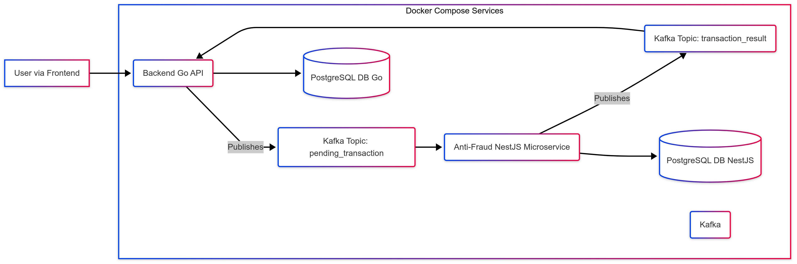

# Full-Cycle Payment Gateway

## Overview

This project demonstrates a simplified, full-cycle payment processing workflow, featuring a decoupled architecture with dedicated services for frontend interaction, backend processing, and asynchronous fraud detection using Kafka.

## Architecture

The system consists of three main components orchestrated via Docker Compose (except for the frontend during local development):

1.  **Frontend (`frontend-next/`)**:
    *   A Next.js (React) application providing the user interface for creating and viewing invoices.
    *   Interacts with the Backend Go API.
    *   Runs as a separate process during local development (`npm run dev`).

2.  **Backend API (`backend-go-api/`)**:
    *   A Go service handling core business logic, including account management, invoice creation, status updates, and exposing API endpoints for the frontend.
    *   Persists its primary data (accounts, invoices) in a dedicated PostgreSQL database instance (`db_go` in `docker-compose.yml`).
    *   Publishes new, pending invoice transactions to Kafka.
    *   Consumes fraud check results from Kafka to update invoice statuses.

3.  **Anti-Fraud Microservice (`anti-fraud-micro-service/`)**:
    *   A NestJS service responsible for analyzing transactions for potential fraud based on a set of configurable rules (e.g., unusual amount detection using MAD, suspicious account checks).
    *   Consumes pending transactions from Kafka.
    *   Publishes fraud analysis results (approved/rejected) back to Kafka.
    *   Maintains its own state (e.g., fraud rule configurations, potentially historical data summaries if needed) in a separate, dedicated PostgreSQL database instance (`db_nestjs` in `docker-compose.yml`). This ensures data isolation between core processing and fraud analysis.

### Communication Flow




1.  The User interacts with the Frontend (Next.js).
2.  The Frontend sends requests to the Backend Go API.
3.  The Backend API creates an invoice (initially pending), stores it in its database (`db_go`), and publishes a message to the `pending_transaction` Kafka topic.
4.  The Anti-Fraud Microservice consumes the message, performs fraud checks (potentially querying its own database, `db_nestjs`), and publishes the result (`APPROVED` or `REJECTED`) to the `transaction_result` Kafka topic.
5.  The Backend Go API consumes the result message and updates the invoice status in its database (`db_go`).
6.  The Frontend can then query the Backend Go API to display the final invoice status.

## Technology Stack Summary

*   **Frontend:** Next.js, React, TypeScript, Tailwind CSS
*   **Backend API:** Go, Gin (or standard library HTTP), Kafka client library
*   **Anti-Fraud Service:** NestJS, TypeScript, Kafka client library, Prisma
*   **Messaging:** Apache Kafka
*   **Databases:** PostgreSQL (Separate instances for Go Backend and NestJS Service)
*   **Containerization:** Docker, Docker Compose

## Prerequisites

*   Docker & Docker Compose (Docker Desktop or equivalent Linux setup)
*   Node.js (LTS version recommended, e.g., v20+) and npm (for running the frontend locally)
*   Go (if modifying or running the backend outside Docker)

## Running the Project (Local Development)

1.  **Clone the Repository:**
    ```bash
    git clone <repository-url>
    cd full-cycle-payment-gateway
    ```

2.  **Start Backend & Infrastructure:**
    Ensure Docker is running. In the root directory (`full-cycle-payment-gateway`), start all backend services, databases, Kafka using Docker Compose:
    ```bash
    docker-compose up -d
    ```
    *   Use `docker-compose logs -f` to tail the logs of all services or `docker-compose logs -f <service_name>` (e.g., `kafka`, `backend-go-api`, `anti-fraud-micro-service`) for specific logs.

3.  **Run the Frontend:**
    Open a *separate terminal*:
    ```bash
    cd frontend-next
    npm install
    npm run dev
    ```

4.  **Access Points:**
    *   **Frontend:** [http://localhost:3000](http://localhost:3000)
    *   **Backend Go API:** [http://localhost:8080](http://localhost:8080) (Mapped from container port 8080).
    *   **Anti-Fraud API (if applicable):** [http://localhost:3333](http://localhost:3333) (Mapped from container port 3000).

## Further Details

Each component directory contains its own `README.md` file with more specific information regarding its setup, configuration, internal architecture, and database schema (where applicable):

*   `frontend-next/README.md`
*   `backend-go-api/README.md`
*   `anti-fraud-micro-service/README.md`
